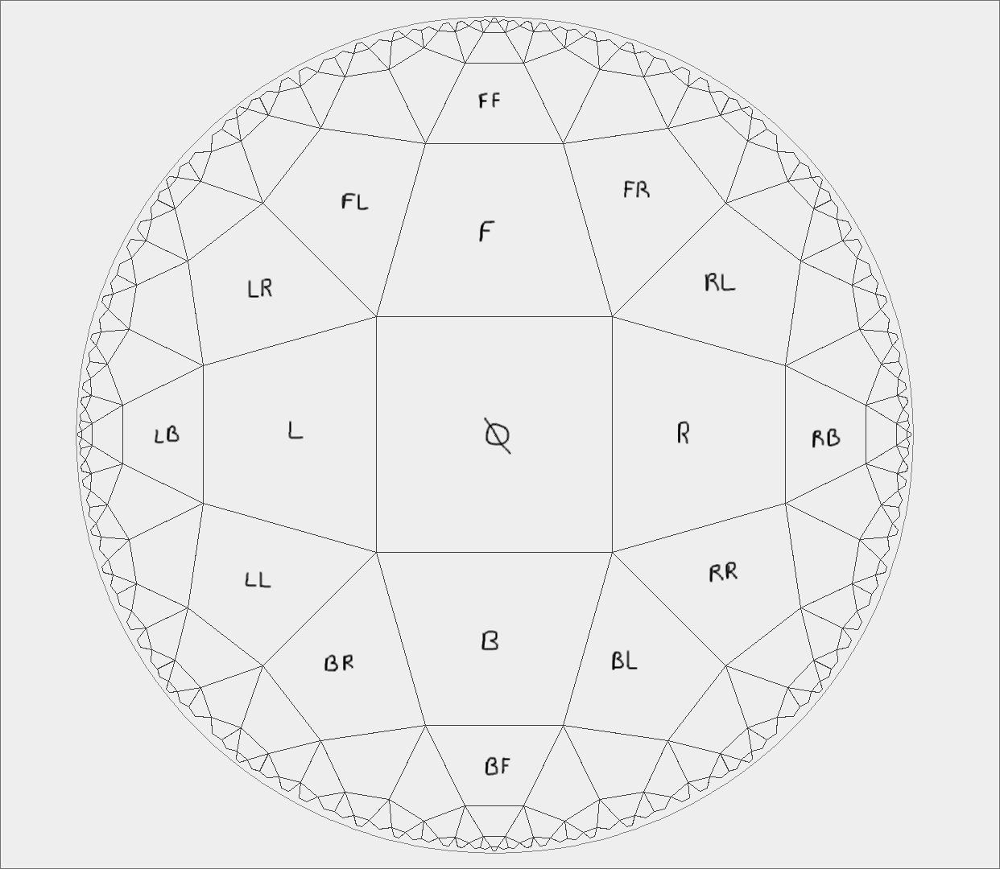
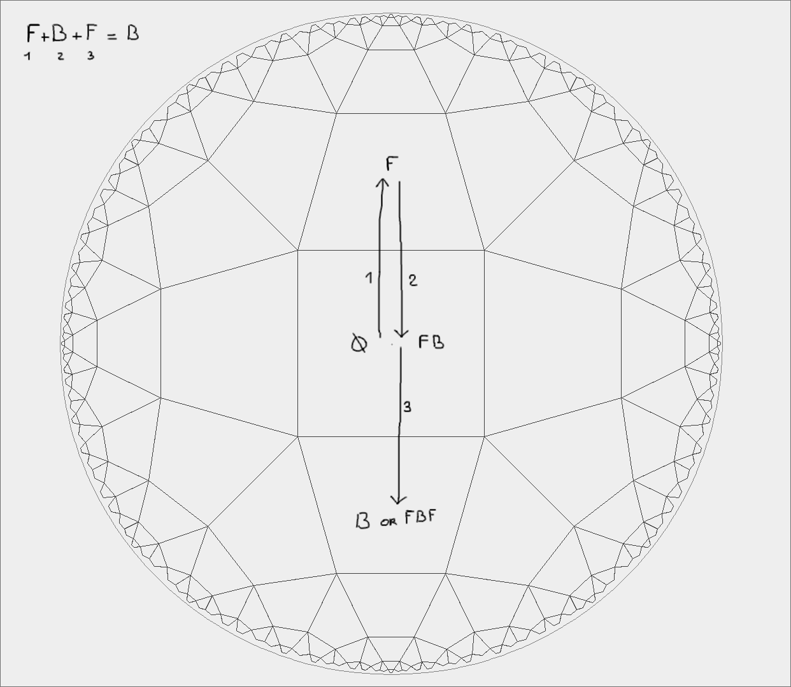
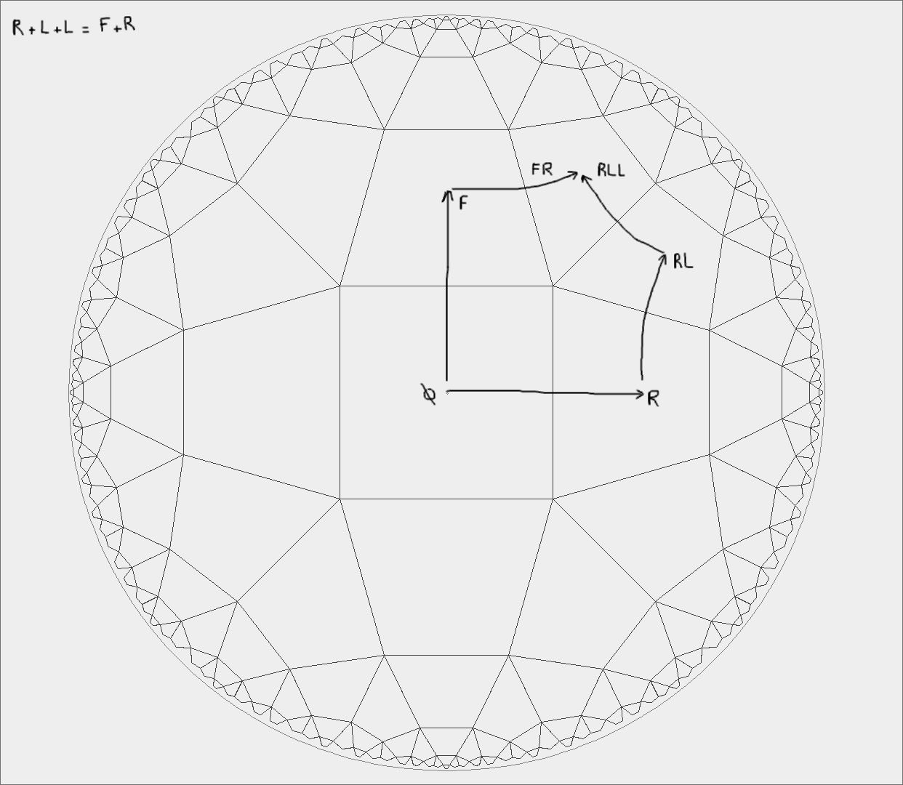
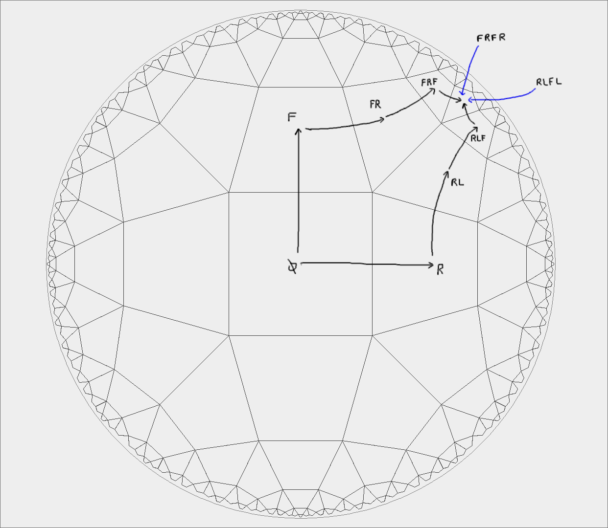

# Coordinate System in a Hyperbolic Tessellation

For the remainder of this project, we will use a hyperbolic tiling of type %%\{4,5\}%% because, in my view, it offers the most interesting properties.

In a Euclidean tiling, a discrete coordinate system is rather straightforward (see [discrete coordinate systems for plane tilings](https://duriansoftware.com/joe/discrete-coordinate-systems-for-plane-tilings)). However, for a hyperbolic tiling, the problem is more complex. Interestingly, I found no existing documentation online on this subject, so I developed my own system.

## Defining the Coordinate System

1. **Choosing a Reference Point and Orientation:**  
   First, we arbitrarily select a center point in the hyperbolic plane. From this center, we also choose an arbitrary “forward” direction. This fixed orientation then defines the “left,” “right,” and “backward” directions.

2. **Determining Neighboring Tile Directions:**  
   Once the initial orientation is set, we can, for instance, define the direction to reach the immediately adjacent left tile. The rule applied here is: the “upward” direction corresponds to the edge directly in front of the incoming edge. By repeatedly applying this rule, we can assign a direction to every neighboring tile in the tiling.


   
[Source](https://github.com/user-attachments/assets/747fc1ee-0ace-44b0-91a4-5bda74878908)

Below is a brief example that demonstrates how to build a list of directions, and how the order of these directions is crucial. In this system, the sequence "Forward, Right" is not equivalent to "Right, Forward."

**"Forward, Right":**

1. Start at the center of the hyperbolic plane.
2. Move "Forward" — you advance in your initial, arbitrarily chosen direction.
3. Then, turn "Right" — you change your orientation from the previous forward direction and step into the adjacent tile that lies in that new direction.

**"Right, Forward":**

1. Start at the center of the hyperbolic plane.
2. First, turn "Right" — you immediately adjust your direction from the start, without having advanced.
3. Then, move "Forward" — you advance in this newly set direction.

## Addressing Redundancy: Simplification Rules

A significant challenge is that an infinite number of directional sequences can refer to the same tile. For example, imagine two different sequences that, through rotations or reversals, ultimately lead to the same position in the tiling.

To tackle this problem, I devised three simplification rules. These rules are designed to convert any arbitrary list of directions into one unique canonical sequence, ensuring that different paths leading to the same tile are always reduced to the same representation.

### Rule 1: Backward Destruction

With the method described above, it’s clear that if the forward direction is defined as the edge in front of the incoming edge, then the backward direction naturally corresponds to the incoming edge itself. In other words, **"Backward" truly lives up to its name**, as it cancels the last movement — but it also adjusts orientation in the process.

For example, if you move **Left**, then go **Backward**, your new "Top" direction becomes the **Left** direction of your original state, not the original "Top."

We can formalize this behavior as:

```
X + B + Y = Y'
```

Where:

- `X` is any direction before a **Backward**,
- `B` is the **Backward** direction,
- `Y` is the direction following the backward step,

The simplification rule for `Y'` is:

- `Y' = Y` if `X == Backward`
- `Y' = Y.opposite` if `X == Forward`
- `Y' = Y.anticlockwise` if `X == Right`
- `Y' = Y.clockwise` if `X == Left`

This rule is applied recursively and removes unnecessary steps, helping reduce the sequence to a canonical form.



[Source](https://github.com/user-attachments/assets/0c6d03f6-2ab0-410f-8416-bdcc3971b1f9)

### Rule 2: Repeated Direction Merging

This rule detects consecutive duplicate directions like two **Right** or two **Left** in a row. These often indicate a local rotation pattern, which can be simplified by transforming them into a different sequence that produces the same movement but in fewer or clearer steps.

Examples:

- Two consecutive **Right** turns (`Right, Right`) indicate a sharp turn that can be represented as:
  ```
  X + Right + Right + Y → X.clockwise + Left + Y.clockwise
  ```
- Two **Left**s work similarly:
  ```
  X + Left + Left + Y → X.anticlockwise + Right + Y.anticlockwise
  ```

These rewrites not only reduce the number of steps but also stabilize the orientation for further simplification.



[Source](https://github.com/user-attachments/assets/dffaf00a-2c80-49a1-a035-26a4b012f2f2)

### Rule 3: LF Pattern Transformation

This more advanced rule handles a very specific but frequent pattern in movement:

```
X + Right + (Forward * n) + Right + Y
```

This pattern is equivalent to:

```
X.clockwise + (Left + Forward) * n + Left + Y.clockwise
```

This transformation reorients the structure and reinterprets the motion path in a cleaner, mirrored format.



[Source](https://github.com/user-attachments/assets/02f86a1b-40c2-4969-b8f0-8ceca6b20691)

### Holonomy

In all of the simplification rules, we rely on the presence of a direction following the pattern, such as in:

```
X + B + Y → Y'
X + Right * 2 + Y → X.clockwise + Left + Y.clockwise
X + Right + (Forward * n) + Right + Y → X.clockwise + (Left + Forward) * n + Left + Y.clockwise
```

However, in some cases, the direction `Y` simply doesn't exist — for instance, in sequences like `Left + Right`, `Forward + Right + Right`, or `Left + Right + Forward + Right` etc.

When that happens, instead of applying the transformation directly, we **store the rotation that would have been applied to `Y`** — this is what we call the **[holonomy](https://en.wikipedia.org/wiki/Holonomy)**. It represents the accumulated rotational offset that still needs to be accounted for.

Later, when we want to determine the neighbors of the current tile or adjust its orientation, we can apply this stored holonomy to ensure we’re using the correct direction. This allows us to keep the simplified path consistent with how the full, unsimplified version would have behaved.

Importantly, **holonomy does not affect the position** of the tile — it only captures and tracks **missing or delayed rotations** so they can be reapplied at the right time.

> [!NOTE]
> You can find the complete implementation of the rules in the file [Chunk.java](../../app/src/main/java/dev/cocosol/hyperbolic/paving/Chunk.java).
