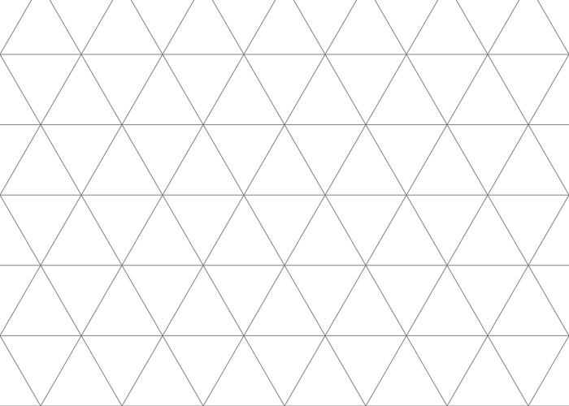
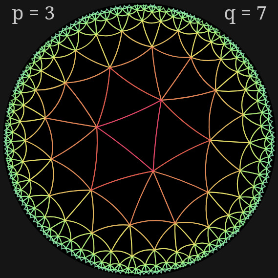
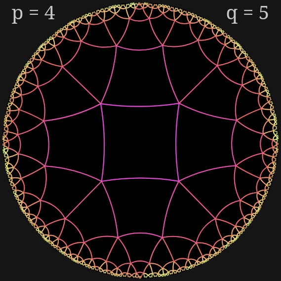
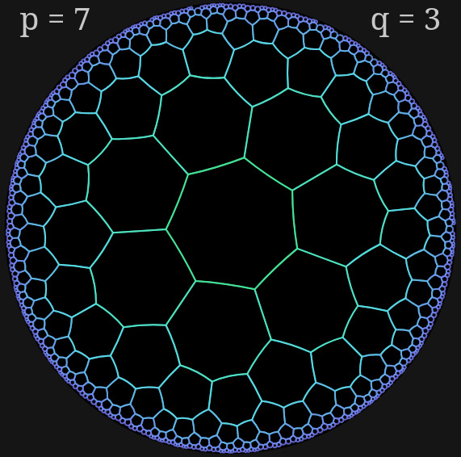

# Introduction to Tessellation

Tessellation, or paving, refers to the process of covering a space entirely with shapes that fit together without gaps or overlaps. This concept appears naturally in both mathematics and the real world—think of tiled floors, beehives, or certain kinds of mosaics. In this chapter, we will explore **Euclidean** and **hyperbolic** tessellations, focusing on regular patterns made from repeating polygons.

## Euclidean Paving

A **Euclidean paving** is a way of subdividing a flat, two-dimensional Euclidean space (the usual geometry we experience daily) using repeating shapes. We’ll focus here on **regular tilings**: arrangements made from identical regular polygons that meet in the same way at each vertex.

To describe a regular tiling, we use two parameters:

- %%p%%: the number of sides of each polygon,
- %%q%%: the number of polygons meeting at a vertex.

This gives us the notation %%\{p, q\}%%, commonly used to describe tilings.

### Example: Hexagonal Tiling

In a **hexagonal tiling**, each tile is a regular hexagon (%%p = 6%%), and three hexagons meet at each vertex (%%q = 3%%). This gives us the notation %%\{6, 3\}%%.

[Source](https://upload.wikimedia.org/wikipedia/commons/7/72/Hexagon_Tiling.svg)

By the way, if you're working with hexagonal grids in programming, check out my Rust library called [**hexing**](https://github.com/cocosol007/hexing), which provides tools for manipulating hexagonal tilings efficiently.

### Example: Triangular Tiling

Here, the tiles are equilateral triangles (%%p = 3%%), and six triangles meet at each vertex (%%q = 6%%). This tiling is represented as %%\{3, 6\}%%.

[Source](https://upload.wikimedia.org/wikipedia/commons/2/23/Triangle_Tiling.svg)

### Example: Square Tiling

The most familiar one: squares with four meeting at each vertex, so %%p = 4%%, %%q = 4%%, written as %%\{4, 4\}%%.

---

### Mathematical Condition

For a tiling to work in the **Euclidean plane**, the internal angles around each vertex must add up to exactly 360°. This requirement leads to a simple formula:

$$\frac{1}{p} + \frac{1}{q} = \frac{1}{2}$$

Solving this, we find that **only three regular tilings** are possible in the Euclidean plane:

- %%\{3, 6\}%% — triangle tiling
- %%\{4, 4\}%% — square tiling
- %%\{6, 3\}%% — hexagonal tiling

---

## Hyperbolic Paving

In **hyperbolic geometry**, the space is curved negatively—think of a saddle shape or something like the surface of a Pringles chip. This allows for much more flexibility in how shapes can fit together.

### Hyperbolic Condition

In hyperbolic tilings, the angle sum around a point can be _less than_ 360°, which changes our condition to:

$$\frac{1}{p} + \frac{1}{q} < \frac{1}{2}$$

This small difference opens up a vast new world: **infinitely many** regular tilings are possible in hyperbolic space!

### Some Visual Examples

Here are a few beautiful examples of hyperbolic tilings:

[Source](https://github.com/user-attachments/assets/bccb3abc-a63c-4961-b86e-a9816b00ca78)

[Source](https://github.com/user-attachments/assets/10625ba6-19bf-43cd-b392-66276e57fa71)

[Source](https://github.com/user-attachments/assets/a48dc8f4-4bfb-434d-95e9-a9ad505794ee)

You can play with these and generate your own using [this interactive site](https://www.malinc.se/noneuclidean/en/poincaretiling.php). Choose different values for %%p%% and %%q%% and explore how hyperbolic tilings behave!
