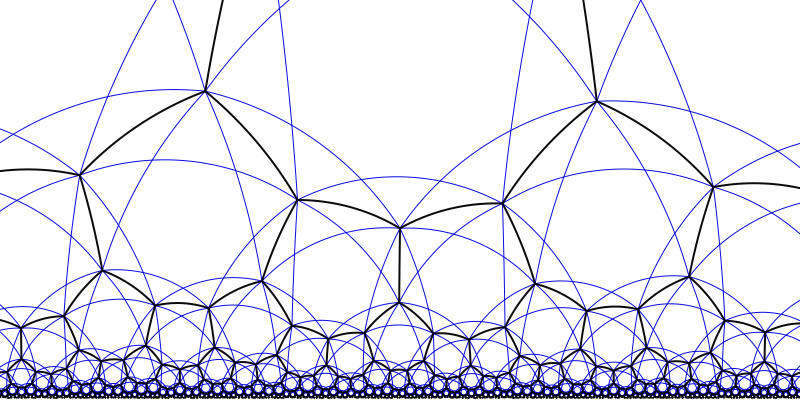

# Other Models

## The Beltrami–Klein Model

Another important representation of the hyperbolic plane is the **[Beltrami–Klein model](https://en.wikipedia.org/wiki/Beltrami%E2%80%93Klein_model)**, also known as the projective model of hyperbolic geometry. Unlike the Poincaré disk model, the Beltrami–Klein model is not [conformal](https://en.wikipedia.org/wiki/Conformal_map), meaning it does not preserve angles. However, it offers other advantages, particularly in how it represents geodesics.

In one of the [earlier chapters](I/basic-mathematics-in-the-poincare-disk-model.md), we introduced the Poincaré disk model, derived by projecting the upper sheet of a two-sheeted [hyperboloid](https://en.wikipedia.org/wiki/Hyperboloid) onto the unit disk in the plane %%z = 0%%. The Beltrami–Klein model is constructed in a similar way, but instead of projecting onto the plane %%z = 0%%, we project the upper sheet of the hyperboloid onto the plane %%z = 1%%. This subtle change leads to a model with distinct geometric properties.

This [animation](https://www.youtube.com/watch?v=9D9AAcbflbU) illustrates the relationship between the Beltrami–Klein and the Poincaré disk models beautifully.

You can also observe the differences between the two models in the image below:

### Key Characteristics

The Beltrami–Klein model is notable for its **projective nature**. It maps the hyperbolic plane into the interior of the Euclidean unit disk, just like the Poincaré disk model. However, unlike the Poincaré model, it **does not preserve angles**. As a result:

- Angles are distorted, especially near the boundary of the disk.
- Circles in the hyperbolic plane appear as **flattened ellipses**.
- **Geodesics** are represented by **straight line segments** within the disk, connecting points inside the boundary—this is one of the major strengths of the model.

This is in contrast to the Poincaré disk model, which **is conformal**, preserving angles but representing geodesics as arcs of circles orthogonal to the boundary.

### Conversion Between Models

One of the convenient features of these two models is that it's easy to **convert a point from the Poincaré disk model to the Beltrami–Klein model**, and vice versa. Let:

- %%\mathbf{p} = (p_x, p_y)%% be the coordinates of a point in the Poincaré disk model, with %%\|\mathbf{p}\| < 1%%.
- %%\mathbf{k} = (k_x, k_y)%% be the coordinates of a point in the Beltrami–Klein model, with %%\|\mathbf{k}\| < 1%%.

#### From Poincaré to Beltrami–Klein

The mapping %%\mathbf{p} \mapsto \mathbf{k}%% is given by:

$$\mathbf{k} = \frac{2\,\mathbf{p}}{1 + \|\mathbf{p}\|^2}.$$

This formula ensures that points in the Poincaré disk are sent to corresponding points in the Klein disk.

#### From Beltrami–Klein to Poincaré

Conversely, the mapping %%\mathbf{k} \mapsto \mathbf{p}%% is:

$$\mathbf{p} = \frac{\mathbf{k}}{1 + \sqrt{1 - \|\mathbf{k}\|^2}}.$$

Here, the denominator restores the conformal scaling necessary to recover the Poincaré metric.

For a visual explanation of how to perform this conversion, see this [video](https://www.youtube.com/watch?v=n55NQbG-Uos).

## Half-Plane Model

You can try this model in 2D by running `./gradlew run2D --args='halfplane'`

Another widely used representation of the hyperbolic plane is the [half-plane model](https://en.wikipedia.org/wiki/Poincar%C3%A9_half-plane_model), also known as the **Poincaré half-plane model**. In this model, the hyperbolic plane is represented by the upper half of the Euclidean plane:

$$\mathbb{H} = \{ (x, y) \in \mathbb{R}^2 \mid y > 0 \}.$$

This model is [conformal](https://en.wikipedia.org/wiki/Conformal_map), like the Poincaré disk model, meaning that it **preserves angles**, making it particularly useful for applications in complex analysis and certain types of geometric proofs.

### Key Characteristics

[Source](https://en.wikipedia.org/wiki/Poincar%C3%A9_half-plane_model#/media/File:Poincare_halfplane_heptagonal_hb.svg)

- **Geodesics** in the half-plane model are either:

  - **Vertical straight lines**, or
  - **Semicircles** centered on the x-axis (i.e., with their centers on the boundary %%y = 0%%).

- **Hyperbolic distances** are different from Euclidean distances. The infinitesimal hyperbolic metric is given by:

  $$ds^2 = \frac{dx^2 + dy^2}{y^2},$$

  meaning that distances increase rapidly as one moves closer to the boundary at %%y = 0%%.

- The boundary %%y = 0%% is **not part of the hyperbolic plane**, but represents "points at infinity," much like the boundary circle in the Poincaré disk model.

### Conversion from the Disk Model

There exists a Möbius transformation that maps the Poincaré disk model to the upper half-plane. A common one is:

$$z \mapsto i \cdot \frac{1 + z}{1 - z},$$

where %%z \in \mathbb{C}%%, representing a point in the unit disk. This transformation preserves angles and maps the unit circle (disk boundary) to the real line (the boundary of the upper half-plane), while the interior of the disk maps to the upper half-plane.

## Gnomonic Projection Model

The **[gnomonic projection model](https://en.wikipedia.org/wiki/Gnomonic_projection)** of hyperbolic geometry is less commonly encountered in introductory treatments, but it's an elegant and insightful construction that emphasizes connections with **[projective geometry](https://en.wikipedia.org/wiki/Projective_geometry)**.

I don't find a lot of documentation on this model online, but I have a [website](https://geometricolor.wordpress.com/2018/11/04/various-projections-of-hyperbolic-kaleidoscopic-images/) that might help.

[Source](https://github.com/user-attachments/assets/23b0f337-2429-4373-aad7-e0cc986aa4b7)
